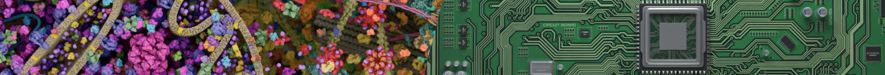
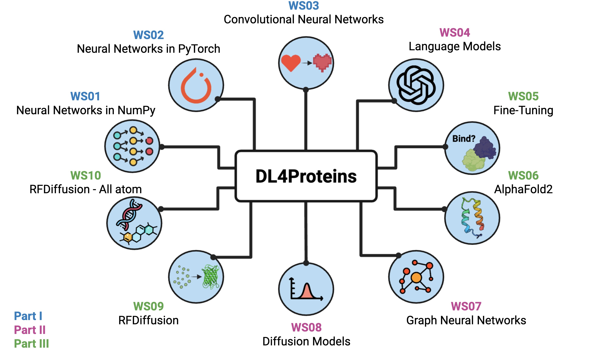

# Deep Learning for Proteins (DL4Proteins) 워크숍

**DL4Proteins에 오신 것을 환영합니다!**

DL4Proteins 노트북 시리즈의 목표는 단백질 설계 및 예측을 위한 딥러닝을 대중화하여 과학계의 혁신적인 순간에 도달하는 것입니다. 2024년 노벨 화학상이 David Baker, Demis Hassabis, John Jumper에게 컴퓨터를 이용한 단백질 설계 및 구조 예측의 획기적인 공로로 수여됨에 따라, 본 자료는 이러한 혁명을 이끈 바로 그 도구와 방법론에 대한 실습 중심의 입문서를 제공합니다. DL4Proteins는 기초 머신러닝 원리와 AlphaFold, RFDiffusion, ProteinMPNN과 같은 최첨단 접근 방식을 결합하여 연구자, 교육자, 학생들이 단백질 공학의 미래에 기여할 수 있는 지식을 갖추도록 돕습니다. 이 오픈 소스 노트북들은 최신 연구와 강의실 학습 간의 간극을 메우며 합성 생물학 및 치료제 분야의 차세대 혁신가를 양성하는 데 기여합니다.

관련 프리프린트(preprint)는 이 노트북 시리즈에 대한 상세한 교육적 프레임워크를 제시하며, 각 노트북의 동기, 학습 성과 및 기저에 깔린 딥러닝 원리들을 설명합니다.

#### 프리프린트:
[DL4Proteins Jupyter Notebooks Teach how to use Artificial Intelligence for Biomolecular Structure Prediction and Design](https://arxiv.org/abs/2511.02128)

아래의 Jupyter 노트북들은 현재 단백질 설계 분야에서 활용되는 핵심적인 머신러닝 개념과 모델에 대한 소개를 제공합니다. 노트북은 Google Colaboratory에서 실행할 수 있습니다.

**그림과 질문이 올바르게 표시되도록 Colab 노트북을 라이트 모드(light mode)로 설정해 주세요.**

### 목차
### [챕터 1: NumPy를 활용한 신경망](https://colab.research.google.com/github/Graylab/DL4Proteins-notebooks/blob/main/notebooks/WS01_NeuralNetworksWithNumpy.ipynb)
### [챕터 2: PyTorch를 활용한 신경망](https://colab.research.google.com/github/Graylab/DL4Proteins-notebooks/blob/main/notebooks/WS02_NeuralNetworksWithPyTorch.ipynb)
### [챕터 3: 합성곱 신경망 (CNN)](https://colab.research.google.com/github/Graylab/DL4Proteins-notebooks/blob/main/notebooks/WS03_ConvolutionalNeuralNetworks.ipynb)
### [챕터 4: 셰익스피어와 단백질을 위한 언어 모델](https://colab.research.google.com/github/Graylab/DL4Proteins-notebooks/blob/main/notebooks/WS04_LMsForShakespeareAndProteins.ipynb)
### [챕터 5: 언어 모델 임베딩과 다운스트림 태스크를 위한 전이 학습](https://colab.research.google.com/github/Graylab/DL4Proteins-notebooks/blob/main/notebooks/WS05_LanguageModelEmbeddingsTransferLearningForDownstreamTask.ipynb)
### [챕터 6: AlphaFold 소개](https://colab.research.google.com/github/Graylab/DL4Proteins-notebooks/blob/main/notebooks/WS06_IntroductionToAF.ipynb)
### [챕터 7: 단백질을 위한 그래프 신경망 (GNN)](https://colab.research.google.com/github/Graylab/DL4Proteins-notebooks/blob/main/notebooks/WS07_GNNsForProteins.ipynb)
### [챕터 8: 디노이징 확산 확률 모델 (DDPM)](https://colab.research.google.com/github/Graylab/DL4Proteins-notebooks/blob/main/notebooks/WS08_DenoisingDiffusionProbabilisticModels.ipynb)
### [챕터 9: 종합 - RFDiffusion에서 ProteinMPNN, AlphaFold까지](https://colab.research.google.com/github/Graylab/DL4Proteins-notebooks/blob/main/notebooks/WS09_PuttingItAllTogether_DesigningProteins.ipynb)
### [챕터 10: RFDiffusion 소개 - All Atom](https://colab.research.google.com/github/Graylab/DL4Proteins-notebooks/blob/main/notebooks/WS10_RFDiffusion_AllAtom.ipynb)

문제가 발생하면 [Issues 탭](https://github.com/Graylab/DL4Proteins-notebooks/issues)에 남겨주세요. 이 리포지토리는 지속적으로 피드백을 반영하며 업데이트되고 있습니다!

저자: Michael F. Chungyoun, Sreevarsha Puvada, Gabriel Au, Courtney Thomas, Britnie J. Carpentier, Jeffrey J. Gray

감사의 말: Sergey Lyskov, Sergey Ovchinnikov, Johns Hopkins 2023년 540.614/414 단백질 구조 예측 수업 수강생들, 그리고 Johns Hopkins Center for Teaching Excellence and Innovation - Instructional Enhancement Grant.

인용 및 추가 리소스: 이 리포지토리의 각 노트북은 주요 온라인 도구, 교육 자료, 출판물, 오픈 소스 리포지토리 등 다양한 최첨단 리소스에서 영감과 방법론을 얻었습니다. 주요 리소스에는 Harrison Kinsley, Andrej Karpathy, Petar Veličković의 유튜브 시리즈가 포함됩니다. 이러한 자료들은 각 노트북 내에서 인용되었으며, 사용자가 더 깊은 통찰력을 얻기 위해 이러한 기본 저작물들을 탐구할 것을 권장합니다.
